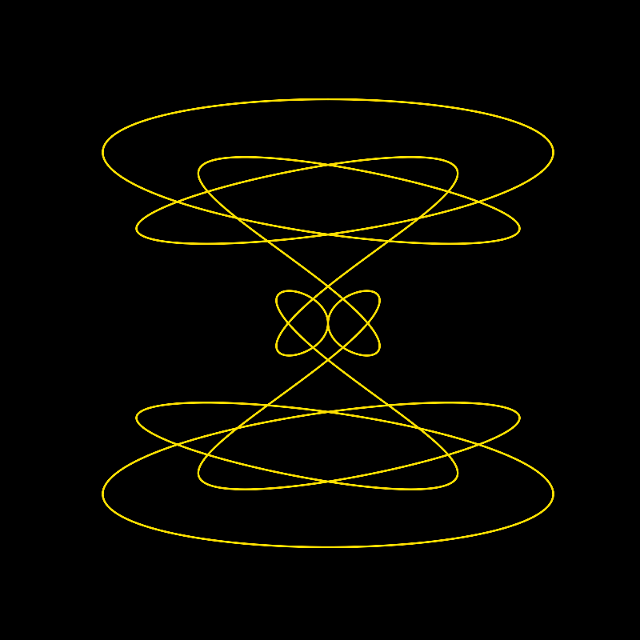
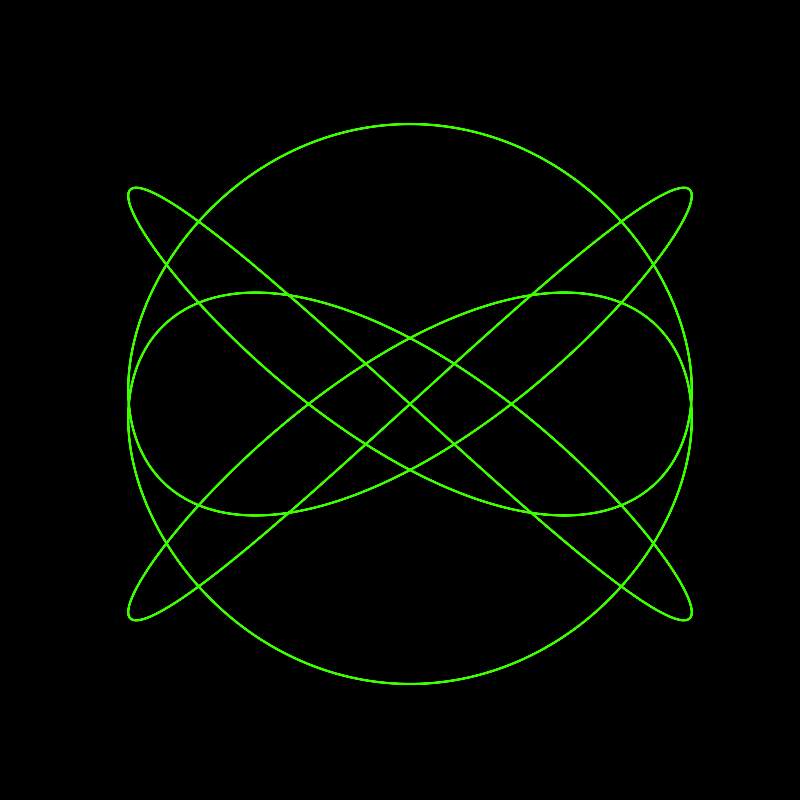

# Algorithmic Art - Mathematical Curves
Welcome to this collection of algorithmic artworks inspired by mathematical curves. These visual compositions are generated using parametric equations, showcasing the intersection of mathematics and art.

# Artwork Mint Site
https://harmony-in-curves.vercel.app/

# Initial Collection Size
I have 500 artworks up for sale for 0.3 SOL each. 

# Example Images

# Artwork Overview
The underlying mathematical structure of these artworks is defined by a parametric equation:

x(t) = A * sin(a * t) + B * sin(b * t)

y(t) = C * cos(c * t) + D * cos(d * t)

Here, t is the parameter that varies over time, and A, B, C, D, a, b, c, and d are constants influencing the shape and appearance of the curves. Feel free to explore how changing these constants affects the visual outcome of the curves.

# Viewing and Verification
To explore and verify the mathematical foundation of these artworks:

Utilize graphing tools like Desmos, Wolfram Alpha, or Python with Matplotlib to input the parametric equation and constants.

Observe how the changing values of t influence the curves.

Compare the visual output with the mathematical equation provided in this README.

Experiment with altering constants to see their impact on the shape and pattern.

# Components:

Understand the role of each term in the equation.

A * sin(a * t) and B * sin(b * t) contribute to the horizontal component.

C * cos(c * t) and D * cos(d * t) affect the vertical component.

# Experimentation:

Experiment with different sets of constants to observe how subtle changes lead to diverse visual outcomes.

# Artistic Intuition:

Recognize that artistic intuition may influence color choices, line thickness, or additional artistic elements.

# Artist Contact Details

Twitter: @songkailiweb3
Discord: songkaili

# Future Planned Collections

I plan to release more algorithmic art collections in the future! Stay tuned!

# A note from the creator

This collection seeks to bridge the gap between mathematics and art, inviting viewers to appreciate the aesthetic beauty derived from underlying mathematical principles.

Enjoy exploring the mathematical intricacies behind these algorithmic artworks!